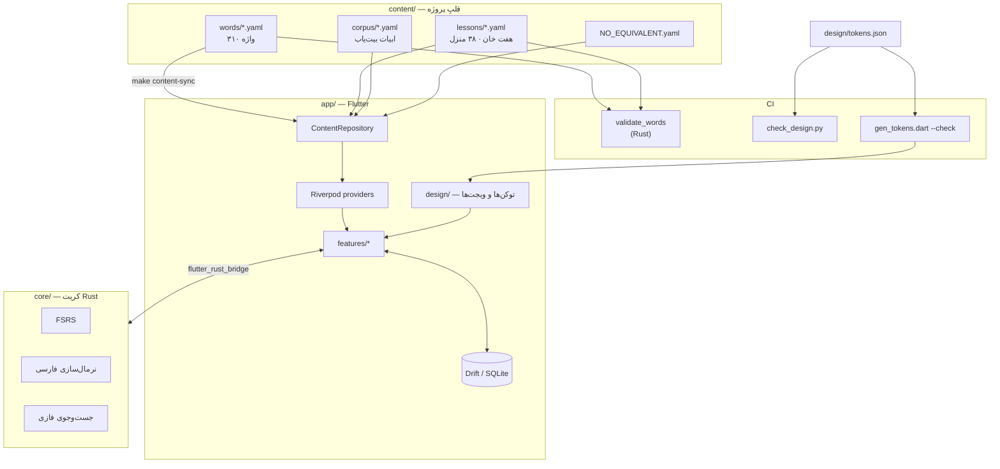
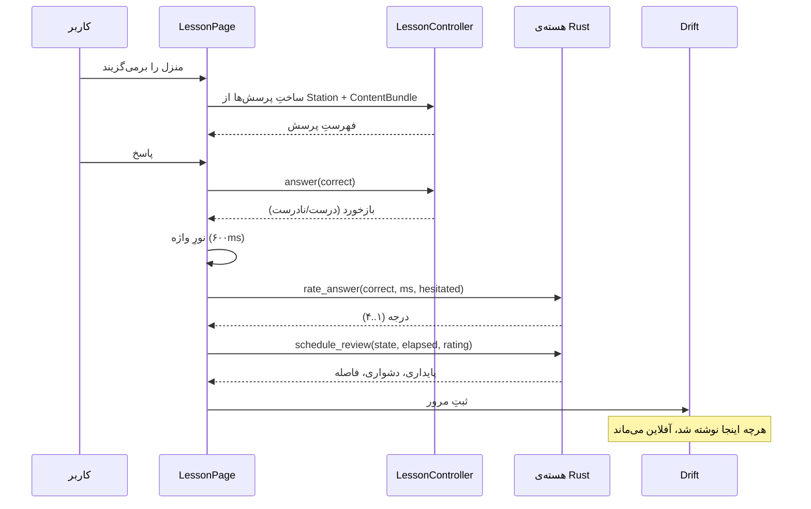

# معماری

> آفلاین‌اول، بی‌استثنا. اپ باید بدون اینترنت کامل کار کند؛ حساب کاربری اختیاری
> است؛ هیچ تحلیل‌گر شخصِ ثالثی در کار نیست.

## ۱. نمای کلی



## ۲. ساختار پوشه‌ها

```
sareh/
├── app/                    # اپ Flutter
│   ├── lib/
│   │   ├── core/           # تم، گذارها، مسیریابی
│   │   ├── design/         # سامانه‌ی طراحی — توکن‌ها، ویجت‌های پایه، نورِ واژه
│   │   ├── features/       # هر ویژگی یک پوشه‌ی مستقل
│   │   │   ├── journey/    # هفت‌خان
│   │   │   ├── lesson/     # موتور تمرین
│   │   │   ├── review/     # مرور FSRS
│   │   │   ├── dictionary/ # واژه‌نامه‌ی قابل‌جست‌وجو
│   │   │   └── profile/
│   │   └── shared/         # مدل‌ها، مخزنِ محتوا
│   ├── shaders/            # سایه‌زن‌های قطعه‌ای
│   └── test/
├── core/                   # کریت Rust
├── content/                # ⭐ قلب پروژه
├── design/                 # tokens.json، بسته‌های نماد، قلم‌ها
├── tools/                  # اعتبارسنج، سازنده‌ی توکن، نگهبانِ طراحی
├── docs/
└── .github/workflows/
```

قاعده: **هر ویژگی یک پوشه‌ی مستقل.** `features/lesson` نباید از
`features/journey` چیزی وارد کند مگر از راهِ `shared/`. اگر لازم شد، یعنی آن
چیز به `shared/` تعلق دارد.

## ۳. جریانِ داده



نکته‌ی مهم: **درجه‌بندی از رفتار برداشت می‌شود، نه از خودسنجی.** کاربر چهار
دکمه‌ی «دوباره/دشوار/خوب/آسان» نمی‌بیند؛ `Rating::from_answer` از درستی، زمانِ
پاسخ و دودلی، درجه را می‌سازد. این هم اصطکاک را کم می‌کند و هم داده‌ی صادق‌تری
می‌دهد.

## ۴. طرح‌واره‌ی پایگاه داده

Drift روی SQLite. همه‌چیز محلی؛ همگام‌سازی اگر روزی بیاید، لایه‌ای روی این
است، نه جایگزینِ آن.

```sql
-- حالتِ حافظه‌ی هر واژه برای این کاربر. یک ردیف به‌ازای هر واژه‌ی دیده‌شده.
CREATE TABLE word_state (
  word_id        TEXT    PRIMARY KEY,       -- = content/words/<id>.yaml
  stability      REAL    NOT NULL,          -- پایداریِ FSRS، به روز
  difficulty     REAL    NOT NULL,          -- ۱٫۰ تا ۱۰٫۰
  due_at         INTEGER NOT NULL,          -- unix ms
  last_review_at INTEGER NOT NULL,
  reps           INTEGER NOT NULL DEFAULT 0,
  lapses         INTEGER NOT NULL DEFAULT 0
);
CREATE INDEX idx_word_state_due ON word_state (due_at);

-- تاریخچه‌ی خام. برای بازآموزیِ پارامترهای FSRS روی داده‌ی خودِ کاربر لازم است؛
-- بی‌آن، بهینه‌سازی ممکن نیست.
CREATE TABLE review_log (
  id           INTEGER PRIMARY KEY AUTOINCREMENT,
  word_id      TEXT    NOT NULL REFERENCES word_state (word_id),
  reviewed_at  INTEGER NOT NULL,
  rating       INTEGER NOT NULL,            -- ۱..۴
  elapsed_days REAL    NOT NULL,
  answer_ms    INTEGER NOT NULL,
  exercise     TEXT    NOT NULL             -- گزینش، بیت‌یاب، …
);
CREATE INDEX idx_review_log_word ON review_log (word_id, reviewed_at);

-- پیشرفت در هفت‌خان.
CREATE TABLE station_progress (
  station_id   TEXT    PRIMARY KEY,
  completed_at INTEGER,                     -- NULL یعنی هنوز تمام نشده
  best_ratio   REAL    NOT NULL DEFAULT 0
);

-- آتشِ جاویدان و شمارنده‌های بازی.
CREATE TABLE streak (
  id             INTEGER PRIMARY KEY CHECK (id = 1),   -- تک‌ردیف
  current_days   INTEGER NOT NULL DEFAULT 0,
  longest_days   INTEGER NOT NULL DEFAULT 0,
  last_active_on TEXT    NOT NULL,           -- تاریخِ محلی YYYY-MM-DD
  jam_e_jam      INTEGER NOT NULL DEFAULT 0  -- محافظِ زنجیره؛ بیشینه ۲
);

-- فَرّ و گوهر.
CREATE TABLE wallet (
  id     INTEGER PRIMARY KEY CHECK (id = 1),
  farr   INTEGER NOT NULL DEFAULT 0,
  gohar  INTEGER NOT NULL DEFAULT 0
);

-- تنظیمات. کلید/مقدار تا افزودنِ تنظیمِ تازه مهاجرت نخواهد.
CREATE TABLE settings (
  key   TEXT PRIMARY KEY,
  value TEXT NOT NULL
);
```

چند تصمیم و چراییِ آنها:

- **`last_active_on` تاریخِ محلی است، نه unix.** زنجیره‌ی روزانه با «روزِ کاربر»
  کار دارد، نه با UTC. کاربری که ساعت ۲۳:۵۰ تمرین می‌کند نباید به‌خاطر منطقه‌ی
  زمانی روزش را ببازد.
- **`review_log` هرس نمی‌شود.** بازآموزیِ پارامترها به تاریخچه نیاز دارد. اگر
  حجم مسئله شد، فشرده می‌شود، نه پاک.
- **`jam_e_jam` بیشینه ۲** — در کد هم، نه تنها در طرح‌واره.
- هیچ جدولی شناسه‌ی کاربر ندارد. پایگاه داده *برای همین دستگاه* است.

## ۵. مرزِ Rust

`flutter_rust_bridge` تنها این سطح را می‌بیند (`core/src/api.rs`):

| تابع | کار |
|---|---|
| `build_index(rows)` | ساختِ نمایه‌ی جست‌وجو، یک بار در آغاز |
| `search_words(query, limit)` | جست‌وجوی فازی، زیر ۵ms روی ۵۰۰۰+ واژه |
| `normalize_text(input)` | نرمال‌سازیِ فارسی برای نمایش و ذخیره |
| `answers_match(typed, expected)` | سنجشِ پاسخِ تایپ‌شده |
| `persian_digits(input)` | اعدادِ پارسی |
| `rate_answer(correct, ms, hesitated)` | درجه از روی رفتار |
| `schedule_first(rating, retention)` | نخستین دیدارِ واژه |
| `schedule_review(state, elapsed, rating, retention)` | مرورِ بعدی |
| `retrievability(state, elapsed)` | نوارِ «آمادگی» در نمایه |

همه‌ی ورودی‌ها و خروجی‌ها داده‌ی ساده‌اند: نه طولِ عمر، نه صفت، نه ارجاعِ
قرضی — چون کدژنِ پل تنها همین زیرمجموعه را می‌فهمد.

بازتولیدِ چسب و ساختِ کتابخانه‌ی بومی:

```bash
make bridge
```

خروجی — `app/lib/src/rust/` در سویِ Dart و `core/src/frb_generated.rs` در
سویِ Rust — تولیدشده است و در git نیست: به نسخه‌ی codegen گره خورده، و
نگه‌داشتنش در مخزن یعنی دو حقیقت.

`app/test/rust_bridge_test.dart` این سطح را **به‌راستی** صدا می‌زند، نه با
بدل: کتابخانه را از `target/release/` برمی‌دارد و از Dart به Rust زنگ
می‌زند. اگر پل ساخته نشده باشد، آزمون‌ها با پیامِ روشن رد می‌شوند. تا پیش از
این، هسته ۷۵ آزمون داشت و اپ هیچ‌کدامشان را اجرا نمی‌کرد.

## ۶. مدیریت وضعیت

Riverpod ۲، بدون کدژن:

| Provider | گونه | زندگی |
|---|---|---|
| `contentProvider` | `FutureProvider<ContentBundle>` | یک بار، تا پایانِ عمرِ اپ |
| `databaseProvider` | `Provider<SarehDatabase>` | تا پایانِ عمرِ اپ؛ با `onDispose` بسته می‌شود |
| `progressRepositoryProvider` | `Provider<ProgressRepository>` | تا پایانِ عمرِ اپ |
| `progressProvider` | `StateNotifierProvider` | تا پایانِ عمرِ اپ؛ از Drift پر می‌شود |
| `lessonControllerProvider(stationId)` | `.autoDispose.family` | تا خروج از صفحه |
| `settingsProvider` | `StateProvider<AppSettings>` | تا پایانِ عمرِ اپ |

`autoDispose` روی منزل عمدی است: بیرون رفتن از یک منزل باید حالتش را دور
بیندازد، وگرنه بازگشت به آن، نیمه‌کاره‌ی دفعه‌ی پیش را نشان می‌دهد.

## ۷. سنجش‌های CI

| سنجش | ابزار | چه چیزی را نگه می‌دارد |
|---|---|---|
| طرح‌واره‌ی واژه‌ها | `cargo run -p sareh-tools --bin validate_words` | مدخلِ بی‌منبع رد می‌شود |
| ارجاعِ درس‌ها | همان | منزل به واژه‌ی ناموجود ارجاع ندهد؛ واژه‌ای بی‌منزل نماند |
| ۴ گونه در هر منزل | همان | یکنواختی، قاتلِ تداوم است |
| کنتراست AA | `tools/check_design.py` | خواناییِ متن |
| رنگ و اندازه‌ی هارد‌کد | همان | tokens.json تنها منبعِ حقیقت |
| هم‌خوانیِ توکن‌ها | `dart run tools/gen_tokens.dart --check` | فایلِ تولیدشده کهنه نماند |
| آزمون‌های هسته | `cargo test --workspace` | FSRS و نرمال‌سازی |
| آزمون‌های اپ | `flutter test` | موتورِ تمرین، طراحی، و ماندگاری روی SQLite واقعی |

## ۸. آنچه هنوز ساخته نشده

راست‌گویی درباره‌ی وضعیت، خودش بخشی از معماری است:

- **هشت گونه از دوازده گونه‌ی تمرین** هنوز نیامده‌اند. موتور آماده‌ی آنهاست:
  یک زیرگونه‌ی `Question` و یک ویجت، و `_build` یک شاخه‌ی تازه می‌گیرد.
- **بسته‌های نمادِ دوم و سوم** («کهن» و «هندسی») هنوز نیامده‌اند؛ تنها
  «اسطوره» هست.
- **پل ساخته و آزموده شده، ولی هنوز در جریانِ تمرین ننشسته.** موتورِ تمرین
  هنوز `answers_match` و `schedule_review` را صدا نمی‌زند؛ گامِ بعدی همان است.
- **صدا** هنوز نیست.
- **رویارویی** (گونه‌ی دوازدهم) به بک‌اند نیاز دارد و فازِ دوم است.
